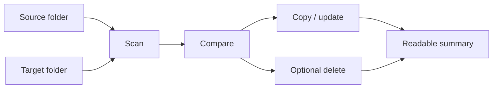

<div align="center">

# ⚡ FastSync

**Fast folder sync, written in Rust.**

Mirror a source folder into a target folder with speed, clear previews, and safer overwrite behavior.

[](LICENSE)
[](https://www.rust-lang.org/)
[](https://doc.rust-lang.org/edition-guide/rust-2024/index.html)
[](https://github.com/BLAKE3-team/BLAKE3)
[](https://github.com/ShouChenICU/FastSync)

[简体中文](README.zh-CN.md) · [Extreme Performance](#-extreme-performance) · [Safety](#-safety-first-by-default) · [Install](#-install) · [Language](#-language) · [CLI](#-cli-cheat-sheet)

</div>

| Fast                                                        | Predictable                                          | Protects existing files                                   |
| ----------------------------------------------------------- | ---------------------------------------------------- | --------------------------------------------------------- |
| Rust, metadata-aware comparison, BLAKE3, concurrent workers | Dry-run first, explicit deletion, readable summaries | Avoids leaving corrupted partial files after interruption |

## ✨ Why FastSync?

FastSync is built for large local folders where speed matters, but silent mistakes are unacceptable.

- **Written in Rust**: fast native execution, predictable resource use, and a small deployment story.
- **Fast by design**: metadata-aware comparison, BLAKE3, and concurrent workers.
- **Safe by default**: no implicit deletion, dry-run support, and temporary-file overwrite writes.
- **Clear after every run**: readable summaries for humans, JSON for scripts.



## 🏎️ Extreme Performance

Directory sync is a mix of filesystem latency, metadata checks, hashing, and copying. FastSync keeps those stages explicit and controlled.

| Performance design        | How it helps                                                                                                                         |
| ------------------------- | ------------------------------------------------------------------------------------------------------------------------------------ |
| Rust implementation       | Native binary performance with predictable memory and CPU behavior.                                                                  |
| Metadata-aware comparison | Uses file size and modified time where they are valid content signals, while metadata synchronization stays separately configurable. |
| BLAKE3 hashing            | Uses a very fast modern hash for strong content comparison when needed.                                                              |
| Bounded worker queue      | Keeps copying concurrent without letting memory usage grow without control.                                                          |
| Direct new-file copy      | Files missing from the target are copied directly, avoiding unnecessary temporary rename overhead.                                   |

> [!NOTE]
> Fast comparison is the default. Use `--strict` when same-metadata files should still be confirmed with BLAKE3.

## 🚀 Quick Start

Preview the sync:

```bash
fastsync -n ./source ./target
```

Run it for real:

```bash
fastsync ./source ./target
```

Mirror and remove stale target files:

```bash
fastsync -n -d ./source ./target
fastsync -d ./source ./target
```

> [!CAUTION]
> `--delete` removes files from the target when they do not exist in the source. Preview with `-n -d` before the first real deletion run.

## 📦 Install

FastSync uses the Rust 2024 edition and requires Rust 1.85 or newer. With `rustup`, use the stable toolchain:

```bash
rustup default stable
rustup component add rust-src
```

### Install from crates.io

```bash
cargo install fastsync
fastsync --help
```

### Build from source

```bash
git clone https://github.com/ShouChenICU/FastSync.git
cd FastSync
cargo build --release
./target/release/fastsync --help
```

### Install from Git

```bash
cargo install --git https://github.com/ShouChenICU/FastSync
```

## 🌐 Language

FastSync supports English and Simplified Chinese. It detects common system locales automatically, and you can override the language when needed:

```bash
fastsync --lang zh-CN --help
FASTSYNC_LANG=zh-CN fastsync --help
```

## 🧭 Common Workflows

| Goal                               | Command                               |
| ---------------------------------- | ------------------------------------- |
| Preview a sync                     | `fastsync -n ./source ./target`       |
| Sync one folder into another       | `fastsync ./source ./target`          |
| Sync and delete stale target files | `fastsync -d ./source ./target`       |
| Use strict comparison              | `fastsync --strict ./source ./target` |
| Limit worker threads               | `fastsync -t 4 ./source ./target`     |
| Output JSON for scripts            | `fastsync -o json ./source ./target`  |

<details>
<summary><strong>Example: safe backup mirror</strong></summary>

```bash
# First run: inspect what would happen.
fastsync -n -d ~/Photos /mnt/backup/Photos

# Second run: apply the same operation.
fastsync -d ~/Photos /mnt/backup/Photos
```

</details>

<details>
<summary><strong>Example: fast cache mirror</strong></summary>

```bash
fastsync ./target/release ./cache/release
```

The default fast mode trusts matching metadata, then hashes only when same-size files have differing modified times or supported permissions.

</details>

## 🛡️ Safety First By Default

| Default                  | Why it matters                                                                                                                                         |
| ------------------------ | ------------------------------------------------------------------------------------------------------------------------------------------------------ |
| One-way sync             | The source is the authority; the target follows it.                                                                                                    |
| No implicit deletion     | Target-only files are preserved unless `--delete` is used.                                                                                             |
| Fast comparison          | Existing files trust matching metadata by default, and use BLAKE3 only for same-size files whose metadata differs.                                     |
| Temporary-file overwrite | Existing targets are written to a temporary filename first, then renamed into place, reducing the chance of leaving a partial file after interruption. |
| Direct new-file copy     | Missing target files are copied directly, without unnecessary rename overhead.                                                                         |
| Dry-run support          | You can inspect the plan before changing anything.                                                                                                     |

## 🔍 Choose A Comparison Mode

| Mode     | Behavior                                                                                                                                                                        | Use when                                                             |
| -------- | ------------------------------------------------------------------------------------------------------------------------------------------------------------------------------- | -------------------------------------------------------------------- |
| `fast`   | If metadata matches, treats the file as unchanged. If metadata differs, size differences are changed immediately; same-size files are checked with BLAKE3. This is the default. | You want good speed while still hashing ambiguous same-size changes. |
| `strict` | If sizes match, checks content with BLAKE3 even when metadata also matches.                                                                                                     | You want content confirmation for every existing same-size file.     |

`--strict` is a shortcut for `--compare strict`.

> [!IMPORTANT]
> Fast mode can miss content changes when size, modified time, and supported permissions stay the same. Use `strict` for important data that needs content confirmation even when metadata matches.

Same-name file metadata synchronization is separate from content comparison and is enabled by default. Use `--no-sync-metadata` to skip standalone metadata updates, or `--preserve-times false` and/or `--preserve-permissions false` to narrow which metadata is preserved.

## ✅ Verification

Post-copy verification is controlled by `--verify`:

| Mode      | Behavior                                       |
| --------- | ---------------------------------------------- |
| `none`    | Do not verify after copying.                   |
| `changed` | Verify overwritten files. This is the default. |
| `all`     | Verify all regular source files after sync.    |

The summary reports BLAKE3 content checks in two separate counters: comparison-time checks used by `fast` or `strict`, and post-copy verifications controlled by `--verify`.
New files that do not exist in the target are copied directly and are not counted as post-copy BLAKE3 verifications.

## 🧾 CLI Cheat Sheet

| Option                                       | Meaning                                                                   |
| -------------------------------------------- | ------------------------------------------------------------------------- |
| `-n`, `--dry-run`                            | Preview only; do not modify the target.                                   |
| `-d`, `--delete`                             | Delete target entries that no longer exist in the source.                 |
| `--strict`                                   | Use strict BLAKE3 confirmation for same-size existing files.              |
| `-c`, `--compare <fast\|strict>`             | Select the comparison strategy.                                           |
| `--no-sync-metadata`                         | Do not update metadata for same-name files whose content already matches. |
| `--preserve-times <auto\|true\|false>`       | Control timestamp synchronization.                                        |
| `--preserve-permissions <auto\|true\|false>` | Control permission synchronization.                                       |
| `--verify <none\|changed\|all>`              | Select post-copy verification.                                            |
| `-t`, `--threads <N\|auto>`                  | Set the worker count.                                                     |
| `-q`, `--queue-size <N>`                     | Set the bounded task queue size.                                          |
| `--no-atomic-write`                          | Disable temporary-file overwrite writes.                                  |
| `-o`, `--output <text\|json>`                | Select summary format.                                                    |
| `-l`, `--log-level <level>`                  | Set log verbosity.                                                        |
| `--lang <en\|zh-CN>`                         | Select interface language. Also accepts common locale aliases.            |

Print the full help page:

```bash
fastsync --help
```

Running `fastsync` without arguments also prints help.

## 🧪 Development

This crate sets `edition = "2024"` in `Cargo.toml`. That is the Rust edition name, not the current calendar year; Rust editions are opt-in language compatibility milestones, and the 2024 edition remains current even when building in 2026.

```bash
cargo fmt --check
cargo test
cargo clippy --all-targets --all-features -- -D warnings
```

Maintainers and coding agents should read [AGENTS.md](AGENTS.md).

## ❓ FAQ

<details>
<summary><strong>Is FastSync bidirectional?</strong></summary>

No. FastSync is intentionally one-way: source to target.

</details>

<details>
<summary><strong>Will FastSync delete files by default?</strong></summary>

No. Deletion only happens when `--delete` or `-d` is provided.

</details>

<details>
<summary><strong>Should I use <code>--strict</code>?</strong></summary>

Use it for important personal or production data where matching metadata is not enough confidence. For generated files, caches, and build outputs, the default `fast` mode is usually the better tradeoff.

</details>

## 📄 License

FastSync is open source under the [MIT License](LICENSE).

Author: [ShouChen](https://github.com/ShouChenICU)

Repository: [https://github.com/ShouChenICU/FastSync](https://github.com/ShouChenICU/FastSync)
