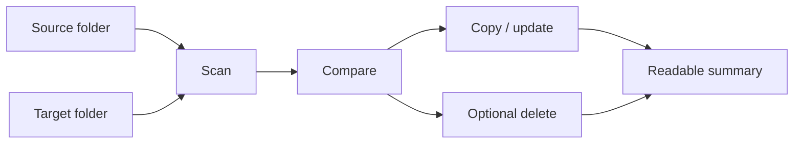

<div align="center">

# ⚡ FastSync

**Fast one-way folder sync, written in Rust.**

Mirror a source folder into a target folder with speed, clear previews, and safer overwrite behavior.

[](LICENSE)
[](https://www.rust-lang.org/)
[](https://github.com/BLAKE3-team/BLAKE3)
[](https://github.com/ShouChenICU/FastSync)

[简体中文](README.zh-CN.md) · [Performance](#-performance-first) · [Safety](#-safety-first-by-default) · [Install](#-install) · [CLI](#-cli-cheat-sheet)

</div>

| Fast | Predictable | Protects existing files |
| --- | --- | --- |
| Rust, metadata-aware comparison, BLAKE3, concurrent workers | Dry-run first, explicit deletion, readable summaries | Avoids leaving corrupted partial files after interruption |

## ✨ Why FastSync?

FastSync is built for large local folders where speed matters, but silent mistakes are unacceptable.

- **Written in Rust**: fast native execution, predictable resource use, and a small deployment story.
- **Fast by design**: metadata-aware comparison, BLAKE3, and concurrent workers.
- **Safe by default**: no implicit deletion, dry-run support, and temporary-file overwrite writes.
- **Clear after every run**: readable summaries for humans, JSON for scripts.



## 🏎️ Performance First

Directory sync is a mix of filesystem latency, metadata checks, hashing, and copying. FastSync keeps those stages explicit and controlled.

| Performance choice | How it helps |
| --- | --- |
| Rust implementation | Native binary performance with predictable memory and CPU behavior. |
| Metadata-aware comparison | Uses file size, modified time, and supported permission bits to quickly classify files. |
| BLAKE3 hashing | Uses a very fast modern hash for strong content comparison when needed. |
| Bounded worker queue | Keeps copying concurrent without letting memory usage grow without control. |
| Direct new-file copy | Files missing from the target are copied directly, avoiding unnecessary temporary rename overhead. |

> [!NOTE]
> `--fast` switches to metadata-only comparison when speed matters more than content-level certainty.

## 🚀 Quick Start

Preview the sync:

```bash
fastsync -n ./source ./target
```

Run it for real:

```bash
fastsync ./source ./target
```

Mirror and remove stale target files:

```bash
fastsync -n -d ./source ./target
fastsync -d ./source ./target
```

> [!CAUTION]
> `--delete` removes files from the target when they do not exist in the source. Preview with `-n -d` before the first real deletion run.

## 📦 Install

### Build from source

```bash
git clone https://github.com/ShouChenICU/FastSync.git
cd FastSync
cargo build --release
./target/release/fastsync --help
```

### Install from Git

```bash
cargo install --git https://github.com/ShouChenICU/FastSync
```

## 🧭 Common Workflows

| Goal | Command |
| --- | --- |
| Preview a sync | `fastsync -n ./source ./target` |
| Sync one folder into another | `fastsync ./source ./target` |
| Sync and delete stale target files | `fastsync -d ./source ./target` |
| Use metadata-only fast mode | `fastsync --fast ./source ./target` |
| Limit worker threads | `fastsync -t 4 ./source ./target` |
| Output JSON for scripts | `fastsync -o json ./source ./target` |

<details>
<summary><strong>Example: safe backup mirror</strong></summary>

```bash
# First run: inspect what would happen.
fastsync -n -d ~/Photos /mnt/backup/Photos

# Second run: apply the same operation.
fastsync -d ~/Photos /mnt/backup/Photos
```

</details>

<details>
<summary><strong>Example: fast cache mirror</strong></summary>

```bash
fastsync --fast ./target/release ./cache/release
```

Use this only when metadata is a good enough signal for your files.

</details>

## 🛡️ Safety First By Default

| Default | Why it matters |
| --- | --- |
| One-way sync | The source is the authority; the target follows it. |
| No implicit deletion | Target-only files are preserved unless `--delete` is used. |
| BLAKE3 comparison | Existing files are checked by content by default. |
| Temporary-file overwrite | Existing targets are written to a temporary filename first, then renamed into place, reducing the chance of leaving a partial file after interruption. |
| Direct new-file copy | Missing target files are copied directly, without unnecessary rename overhead. |
| Dry-run support | You can inspect the plan before changing anything. |

## 🔍 Choose A Comparison Mode

| Mode | Behavior | Use when |
| --- | --- | --- |
| `hash` | Compares existing files with BLAKE3. This is the default. | You want the safest general-purpose behavior. |
| `auto` | Checks metadata first; if metadata matches, confirms content with BLAKE3. | You want metadata screening with content confirmation. |
| `fast` | Checks only modified time, size, and supported permission bits. | You need speed and accept metadata-only risk. |

`--fast` is a shortcut for `--compare fast`.

> [!IMPORTANT]
> Fast mode can miss content changes when size, modified time, and permissions stay the same. Use the default `hash` mode for important data.

## ✅ Verification

Post-copy verification is controlled by `--verify`:

| Mode | Behavior |
| --- | --- |
| `none` | Do not verify after copying. |
| `changed` | Verify overwritten files. This is the default. |
| `all` | Verify all regular source files after sync. |

New files that do not exist in the target are copied directly and are not counted as post-copy BLAKE3 verifications.

## 🧾 CLI Cheat Sheet

| Option | Meaning |
| --- | --- |
| `-n`, `--dry-run` | Preview only; do not modify the target. |
| `-d`, `--delete` | Delete target entries that no longer exist in the source. |
| `--fast` | Use metadata-only comparison. |
| `-c`, `--compare <auto\|fast\|hash>` | Select the comparison strategy. |
| `--verify <none\|changed\|all>` | Select post-copy verification. |
| `-t`, `--threads <N\|auto>` | Set the worker count. |
| `-q`, `--queue-size <N>` | Set the bounded task queue size. |
| `--no-atomic-write` | Disable temporary-file overwrite writes. |
| `-o`, `--output <text\|json>` | Select summary format. |
| `-l`, `--log-level <level>` | Set log verbosity. |

Print the full help page:

```bash
fastsync --help
```

Running `fastsync` without arguments also prints help.

## 🧪 Development

```bash
cargo fmt --check
cargo test
cargo clippy --all-targets --all-features -- -D warnings
```

Maintainers and coding agents should read [AGENTS.md](AGENTS.md).

## ❓ FAQ

<details>
<summary><strong>Is FastSync bidirectional?</strong></summary>

No. FastSync is intentionally one-way: source to target.

</details>

<details>
<summary><strong>Will FastSync delete files by default?</strong></summary>

No. Deletion only happens when `--delete` or `-d` is provided.

</details>

<details>
<summary><strong>Should I use <code>--fast</code>?</strong></summary>

Use it for generated files, caches, build outputs, or low-risk folders where metadata is reliable enough. For important personal or production data, prefer the default `hash` mode.

</details>

## 📄 License

FastSync is open source under the [MIT License](LICENSE).

Author: [ShouChen](https://github.com/ShouChenICU)

Repository: [https://github.com/ShouChenICU/FastSync](https://github.com/ShouChenICU/FastSync)
