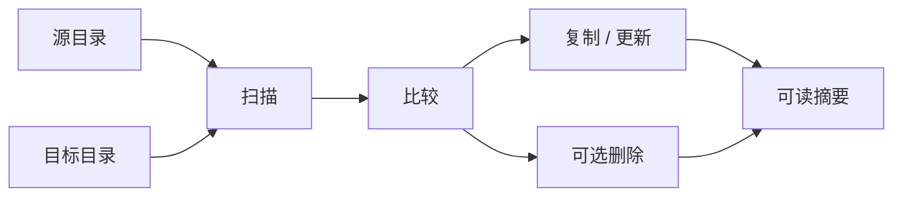

<div align="center">

# ⚡ FastSync

**Rust 编写的高速单向目录同步工具。**

把源目录镜像到目标目录：速度快、可预览、覆盖已有文件时更稳妥。

[](LICENSE)
[](https://www.rust-lang.org/)
[](https://github.com/BLAKE3-team/BLAKE3)
[](https://github.com/ShouChenICU/FastSync)

[English](README.md) · [性能优先](#-性能优先) · [安全模型](#-默认安全模型) · [安装](#-安装) · [命令速查](#-命令速查)

</div>

| 快 | 可预期 | 避免文件损坏 |
| --- | --- | --- |
| Rust、元数据优先、BLAKE3、并发 worker | 先预览、显式删除、摘要清晰 | 降低意外中断后留下不完整文件的风险 |

## ✨ 为什么选择 FastSync？

FastSync 面向大目录、本地镜像和需要明确结果的同步场景：速度要快，但不能悄悄做危险的事。

- **Rust 编写**：原生二进制执行，资源占用更可控，部署也更简单。
- **为速度设计**：元数据感知比较、BLAKE3、并发 worker。
- **默认安全**：不隐式删除、支持预览、覆盖已有文件时使用临时文件。
- **结果清楚**：给人看的摘要，也支持给脚本用的 JSON。



## 🏎️ 性能优先

目录同步通常混合了文件系统延迟、元数据判断、哈希计算和真实复制。FastSync 将这些阶段保持得清晰、可控。

| 性能设计 | 作用 |
| --- | --- |
| Rust 实现 | 原生执行性能，内存和 CPU 行为更可预期。 |
| 元数据感知比较 | 通过大小、修改时间和支持的平台权限位快速分类文件。 |
| BLAKE3 哈希 | 在需要内容确认时，用高速现代哈希算法完成强比较。 |
| 有界 worker 队列 | 并发复制，同时避免任务无限堆积导致内存失控。 |
| 新文件直接复制 | 目标端不存在的新文件直接写入，避免不必要的临时文件重命名开销。 |

> [!NOTE]
> `--fast` 会切换到只看元数据的比较方式，适合更看重速度的场景。

## 🚀 快速开始

预览同步计划：

```bash
fastsync -n ./source ./target
```

真正执行同步：

```bash
fastsync ./source ./target
```

同步并删除目标端陈旧文件：

```bash
fastsync -n -d ./source ./target
fastsync -d ./source ./target
```

> [!CAUTION]
> `--delete` 会删除目标端中“源目录不存在”的项目。首次使用删除模式时，请先用 `-n -d` 预览。

## 📦 安装

### 从源码构建

```bash
git clone https://github.com/ShouChenICU/FastSync.git
cd FastSync
cargo build --release
./target/release/fastsync --help
```

### 使用 Cargo 从 Git 安装

```bash
cargo install --git https://github.com/ShouChenICU/FastSync
```

## 🧭 常见场景

| 目标 | 命令 |
| --- | --- |
| 预览同步 | `fastsync -n ./source ./target` |
| 将一个目录同步到另一个目录 | `fastsync ./source ./target` |
| 同步并删除目标端陈旧项目 | `fastsync -d ./source ./target` |
| 使用只看元数据的快速模式 | `fastsync --fast ./source ./target` |
| 限制 worker 线程数 | `fastsync -t 4 ./source ./target` |
| 为脚本输出 JSON | `fastsync -o json ./source ./target` |

<details>
<summary><strong>示例：安全地同步照片备份</strong></summary>

```bash
# 第一步：先查看会发生什么。
fastsync -n -d ~/Photos /mnt/backup/Photos

# 第二步：确认无误后执行。
fastsync -d ~/Photos /mnt/backup/Photos
```

</details>

<details>
<summary><strong>示例：快速同步构建缓存</strong></summary>

```bash
fastsync --fast ./target/release ./cache/release
```

仅在你确定“元数据足够可靠”的目录中使用这种模式。

</details>

## 🛡️ 默认安全模型

| 默认行为 | 为什么重要 |
| --- | --- |
| 单向同步 | 源目录是权威数据，目标目录跟随源目录。 |
| 不隐式删除 | 不传 `--delete` 时，目标端额外文件会被保留。 |
| BLAKE3 内容比较 | 两端已有文件默认按内容判断是否变化。 |
| 临时文件覆盖写入 | 覆盖已有文件时，默认先写入临时文件名，再重命名到目标路径，降低中断后留下半文件的风险。 |
| 新文件直接复制 | 目标端不存在的新文件直接复制，避免不必要的重命名开销。 |
| 支持预览模式 | 可以在修改目标目录前查看计划。 |

## 🔍 选择比较模式

| 模式 | 行为 | 适合场景 |
| --- | --- | --- |
| `hash` | 使用 BLAKE3 比较两端已有文件，默认模式。 | 重要数据和一般使用场景。 |
| `auto` | 先比较元数据；元数据一致时，再用 BLAKE3 确认内容。 | 希望先用元数据筛选，同时保留内容确认。 |
| `fast` | 只比较修改时间、大小和支持的平台权限位。 | 低风险目录，优先追求速度。 |

`--fast` 是 `--compare fast` 的快捷方式。

> [!IMPORTANT]
> 快速模式可能漏掉“内容变化但大小、修改时间和权限未变化”的文件。重要数据建议使用默认的 `hash` 模式。

## ✅ 校验策略

使用 `--verify` 控制复制后的校验：

| 模式 | 行为 |
| --- | --- |
| `none` | 复制后不校验。 |
| `changed` | 校验发生覆盖的文件，默认模式。 |
| `all` | 同步后校验源目录中的所有普通文件。 |

目标端不存在的新文件会直接复制，不会计入复制后的 BLAKE3 校验次数。

## 🧾 命令速查

| 参数 | 含义 |
| --- | --- |
| `-n`, `--dry-run` | 只预览，不修改目标目录。 |
| `-d`, `--delete` | 删除目标端中源目录不存在的项目。 |
| `--fast` | 使用只看元数据的快速比较。 |
| `-c`, `--compare <auto\|fast\|hash>` | 选择比较策略。 |
| `--verify <none\|changed\|all>` | 选择复制后校验策略。 |
| `-t`, `--threads <N\|auto>` | 设置 worker 线程数。 |
| `-q`, `--queue-size <N>` | 设置有界任务队列长度。 |
| `--no-atomic-write` | 禁用覆盖时的临时文件写入。 |
| `-o`, `--output <text\|json>` | 设置摘要输出格式。 |
| `-l`, `--log-level <level>` | 设置日志级别。 |

查看完整帮助：

```bash
fastsync --help
```

不带任何参数运行 `fastsync` 时，也会输出帮助页面。

## 🧪 开发

```bash
cargo fmt --check
cargo test
cargo clippy --all-targets --all-features -- -D warnings
```

维护者和代码 agent 请阅读 [AGENTS.md](AGENTS.md)。

## ❓ 常见问题

<details>
<summary><strong>FastSync 是双向同步吗？</strong></summary>

不是。FastSync 是单向同步：从源目录同步到目标目录。

</details>

<details>
<summary><strong>FastSync 默认会删除文件吗？</strong></summary>

不会。只有显式传入 `--delete` 或 `-d` 时才会删除目标端额外项目。

</details>

<details>
<summary><strong>我应该使用 <code>--fast</code> 吗？</strong></summary>

如果同步的是生成文件、缓存、构建产物，且元数据足够可靠，可以使用。对于重要个人数据或生产数据，建议使用默认的 `hash` 模式。

</details>

## 📄 开源协议

FastSync 使用 [MIT License](LICENSE) 开源。

作者：[ShouChen](https://github.com/ShouChenICU)

项目地址：[https://github.com/ShouChenICU/FastSync](https://github.com/ShouChenICU/FastSync)
